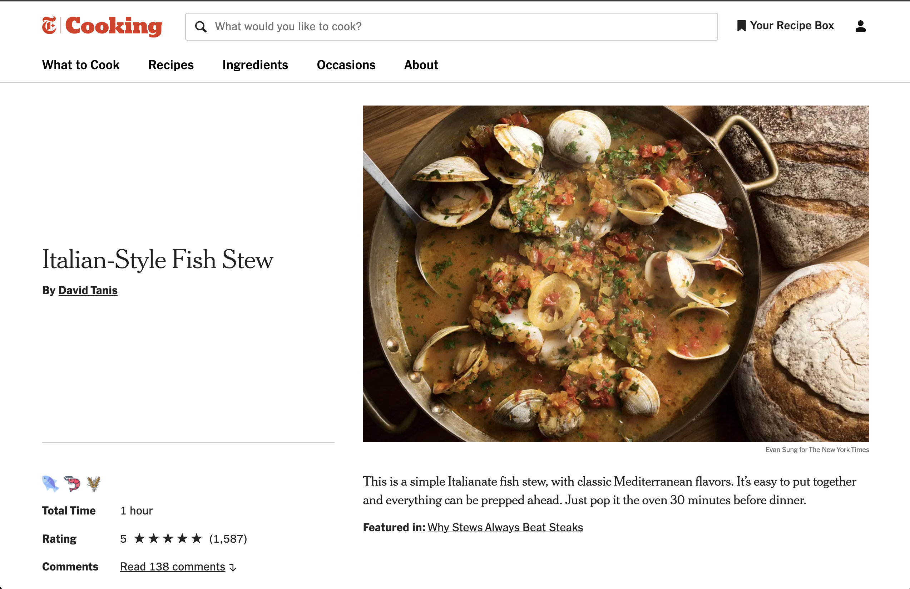

# NYT Cooking Allergen Checker

> ⚠️ **Disclaimer:** This extension uses the ChatGPT 3.5 model to detect allergens. While it aims to be accurate, it may occasionally miss or mislabel allergens. Always double-check ingredient lists manually if you have serious dietary restrictions.

A Chrome extension that automatically scans ingredients on [NYT Cooking](https://cooking.nytimes.com/) recipes and displays icons for the 9 major allergens:
milk, eggs, fish, shellfish, tree nuts, peanuts, wheat, soy, sesame.

## Screenshots

Example 1:  
Recipe page showing allergen icons injected above the Total Time section.


Example 2:  
Another recipe page showing multiple allergens detected correctly.



## Features
- Automatically extracts ingredient lists from NYT Cooking recipes
- Uses the ChatGPT API to detect allergens in natural language
- Displays icons for allergens just above the "Total Time" section
- Clean integration with the site's layout
- Built with Manifest V3, JavaScript, Flask, and OpenAI API

## Installation (Developer Mode)
1. Clone or download this repository
2. Go to `chrome://extensions` in your browser
3. Enable Developer Mode
4. Click "Load unpacked"
5. Select the extension folder

## Folder Structure
```
nyt-allergen-extension/
├── manifest.json
├── background.js
├── content.js
├── app.py
├── icons/
│   ├── milk.png
│   ├── soy.png
│   └── ... (one for each allergen)
```

## Known Limitations
- ChatGPT may occasionally miss an allergen or over-label an ingredient
- Only works on NYT Cooking pages
- API key must be configured manually in `app.py`

## To Do (Future Features)
- Detect required kitchen equipment (e.g. "sheet pan", "Dutch oven")
- Allow user-defined allergen preferences
- Add a popup settings UI
- Recipe scaling functionality